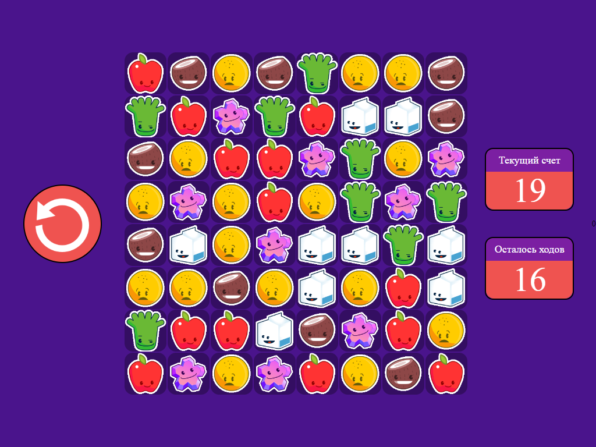

<h1>Игра "Три в ряд"</h1>
  <h3>Классическая головоломка на Реакте:</h3>
  
 Для того, чтобы получать очки, участник должен выстраивать в ряд несколько (минимум три) элементов одного цвета.
  Для этого он может менять два соседних элемента местами. Если в результате сложилась игровая комбинация, «выстроившиеся» элементы исчезают, на их место падают те, что находятся выше. Нужно набрать наибольшее количество очков за 20 ходов.

   

   

  
<h2>Как запустить?</h2>

  <h3>Технические требования:</h3>
    1) Node.js >19.7.0
  

  <h3>Установка:</h3>
  
В корне проекта вызываем комманду:

  <pre>npm install</pre>
  <h3>Запуск</h3>
  
После установки в корне проекта вызываем комманду:

  <pre>npm start</pre>
  
После чего проект откроется в вашем браузере по адресу: http://localhost:3000/

  <h2 >Превью:</h2>  
    
